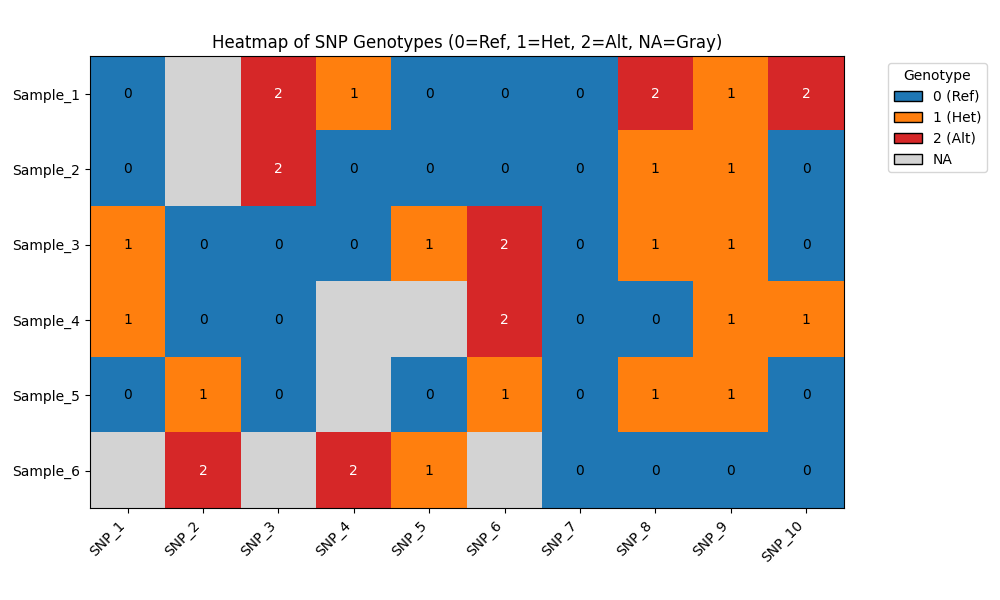

# SNP-genotype-heatmap-visualization
An easy-to-use Python or R script for visualizing multi-sample VCF SNP genotypes as a categorical heatmap, where homozygous reference, heterozygous, homozygous alternate & missing data are color-coded. Ideal for genetic studies, comparative analyses & QC of variant data. 

This repository contains a Python script to visualize SNP genotypes from a multi-sample VCF as a categorical heatmap. Each genotype is represented as:
- `0` = homozygous reference (blue)
- `1` = heterozygous (orange)
- `2` = homozygous alternate (red)
- `NA` = missing data (light gray)

## Contents

- `plot_snp_heatmap.py`: Python script that reads a hardcoded genotype matrix & generates a categorical heatmap image.
- `Rscript categorical_heatmap.R`: R script that reads a hardcoded genotype matrix & generates a categorical heatmap image.
- `categorical_heatmap.png`: Example output heatmap generated by running any of the above scripts.


## Requirements

- Python 3.7+
- NumPy
- Matplotlib

Install dependencies via pip:

```bash

pip install numpy matplotlib

```

## Usage

Clone or download this repository.

Run the Python version of the script:

```bash
   
   python3 plot_snp_heatmap.py

 ```

Run the *R* version of the script:

```bash

   Rscript categorical_heatmap.R

   ```

The script will produce a file named `categorical_heatmap.png` in the project root. This image shows the categorical heatmap with an embedded legend.

## Example



## Customization

- To adapt the script to your own VCF: 
  - Replace the hardcoded `genotypes` array with your parsed genotype matrix (rows = samples, columns = SNPs).
  - Modify the `samples` and `snps` lists to match your sample & SNP names.
- The color palette & labels can be tweaked in the plotting section.

## License

This project is released under the MIT License. 
